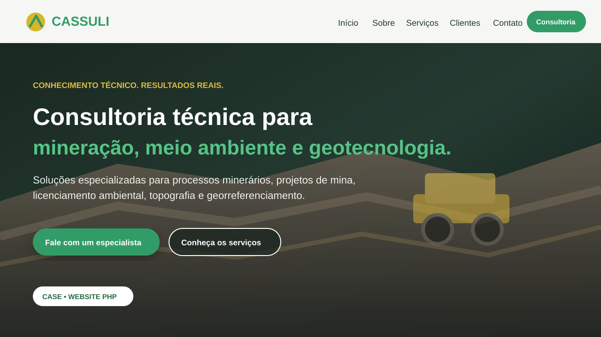
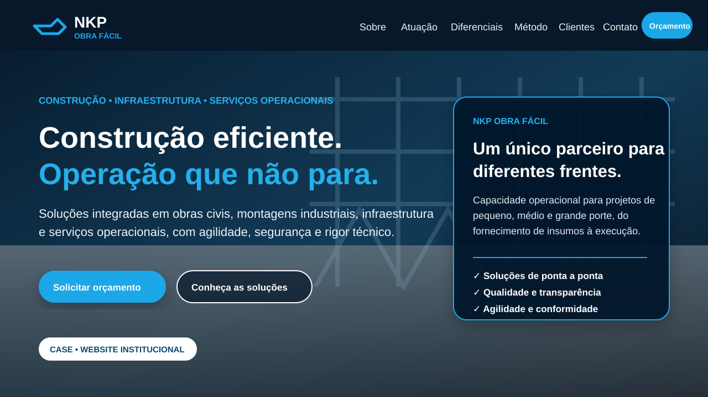

# Portfólio Web — Rafael Peruzini

Repositório de projetos web desenvolvidos para necessidades reais de negócio. Os cases mostram desenvolvimento de sites institucionais, interfaces responsivas, formulários, integração com canais de atendimento e publicação em hospedagem web.

## Projetos

### [Cassuli Consultoria](./cassuli-consultoria/)

Website institucional para consultoria especializada em mineração, meio ambiente e geotecnologia.

**Stack:** PHP · HTML5 · CSS3 · JavaScript · Apache · Hostinger

**Destaques:** site institucional responsivo, apresentação de serviços técnicos, integração com atendimento, páginas legais, SEO básico e estrutura para hospedagem PHP.

➡️ [Ver código e documentação do projeto](./cassuli-consultoria/)

---

### [NKP Obra Fácil](./nkp-obra-facil/)

Website institucional para empresa de engenharia, construção, estruturas metálicas, facilities e suporte operacional.

**Stack:** HTML5 · CSS3 · JavaScript · Node.js · Hostinger

**Destaques:** landing page corporativa responsiva, apresentação de áreas de atuação, navegação dinâmica, integração com canais de contato e estrutura Node.js para execução local.

➡️ [Ver código e documentação do projeto](./nkp-obra-facil/)

## Competências demonstradas

- desenvolvimento de sites e landing pages;
- PHP, JavaScript e Node.js;
- HTML semântico e CSS responsivo;
- formulários e integração com WhatsApp;
- organização de código e documentação;
- publicação em hospedagem compartilhada;
- preocupação com segurança e privacidade ao versionar projetos de clientes.

## Versões públicas dos cases

Para preservar dados operacionais e ativos de terceiros, os projetos publicados aqui usam **dados de contato de demonstração e placeholders SVG** no lugar de telefones, endereços, documentos e mídias originais. A estrutura, lógica e implementação permanecem disponíveis para avaliação técnica.

---

**Rafael Peruzini** — [GitHub @Peruzini](https://github.com/Peruzini)
